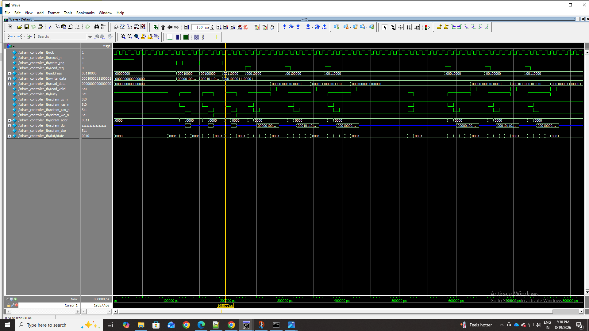

# SDRAM Controller Design

## Overview

This project implements a basic SDRAM controller in Verilog for controlling memory read, write, and refresh operations.

The controller uses a finite state machine (FSM) to manage the sequence of SDRAM operations and provides a simple interface for issuing read and write requests.

The design was verified through simulation using ModelSim.

## Features

- SDRAM initialization sequence
- Read operation control
- Write operation control
- SDRAM refresh operation
- Finite State Machine (FSM) based control
- Address and data handling
- Read-after-write verification
- Read verification after refresh
- Simulation-based functional verification

## Controller Operation

The controller manages the following operations:

1. SDRAM initialization
2. Write request
3. Row activation
4. Data write
5. Read request
6. Row activation
7. Data read
8. Refresh operation

The testbench verifies that data written to memory can be correctly read back from the same address.

## Verification

The design was simulated using ModelSim.

The testbench performs:

- SDRAM initialization
- Three write operations
- Three read operations
- Refresh operation
- Three additional read operations after refresh

### Test Results

| Operation | Result |
|-----------|--------|
| SDRAM Initialization | PASS |
| Write Operations | PASS |
| Read Operations | PASS |
| Refresh Operation | PASS |
| Read After Refresh | PASS |

### Final Simulation Summary

- Total Writes: 3
- Total Reads: 6
- Errors: 0
- Result: **TEST PASSED**

## Simulation Waveform

## Simulation Output

The repository also contains screenshots of the ModelSim transcript showing initialization, write operations, read operations, refresh, and the final successful test result.

## Files

| File | Description |
|------|-------------|
| `sdram_controller.v` | SDRAM controller RTL design |
| `sdram_controller_tb.v` | Verilog testbench for functional verification |
| `sdram_run.do` | ModelSim simulation script |
| `waveform.png` | ModelSim simulation waveform |
| `Screenshot (167).png` | ModelSim simulation output |
| `Screenshot (168).png` | ModelSim read and refresh results |
| `Screenshot (169).png` | Final simulation summary |

## Tools Used

- Verilog HDL
- ModelSim Intel FPGA Edition
- ModelSim Wave Viewer

## Result

The SDRAM controller was successfully simulated and verified with **zero errors**.

The simulation confirms correct write, read, refresh, and read-after-refresh behavior.
